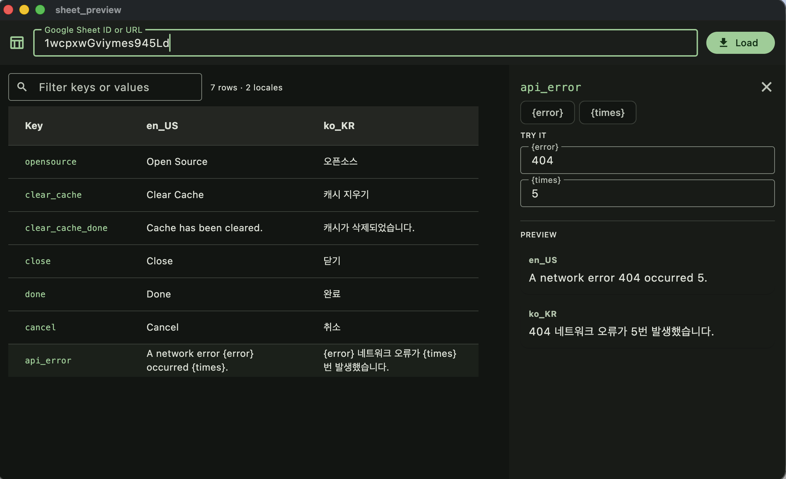

# easy_localization_gsheet

[](https://pub.dev/packages/easy_localization_gsheet)


## Easy Localization Generator

Downloads a CSV file from an online Google Sheet (or uses a local CSV) and generates typed localization keys for [easy_localization](https://pub.dev/packages/easy_localization) and [easy_localization_loader](https://pub.dev/packages/easy_localization_loader).

This tool was inspired by [flutter_sheet_localization_generator](https://pub.dev/packages/flutter_sheet_localization_generator).

> **Note:** This project is a fork of [easy_localization_generator](https://pub.dev/packages/easy_localization_generator). For the original repository, visit [https://github.com/rinlv/easy_localization_generator](https://github.com/rinlv/easy_localization_generator)

### 📦 What's in this repo

| Directory | Description |
|---|---|
| `/` | The generator package (`easy_localization_gsheet`) |
| `easy_localization_gsheet_annotation/` | Lightweight package containing only the `@SheetLocalization` annotation (re-exported by the main package) |
| `sheet_preview/` | Internal macOS desktop tool to preview a sheet's data and try out translation args — see [Sheet Preview tool](#-sheet-preview-tool-macos) |
| `example/` | Example Flutter app using the generator |

### 🔩 Installation

Add to your `pubspec.yaml`:

```yaml
dependencies:
  easy_localization: <last_version>
  easy_localization_loader: <last_version>
  easy_localization_gsheet: <last_version>

dev_dependencies:
  build_runner: <last_version>
```

`easy_localization_gsheet` re-exports the `@SheetLocalization` annotation from the lightweight `easy_localization_gsheet_annotation` package, so a single dependency is all you need.

### 🔌 Usage

#### 1. Create a CSV Google Sheet

Create a sheet with your translations: the first column holds the keys, and each following column holds one locale (header row: `str, en_US, ko_KR, ...`). Make sure that all dynamic-arg strings use *named* args like `{name}` — the generator turns them into readable named parameters.
(Following the below format, [an example sheet is available here](https://docs.google.com/spreadsheets/d/1hK27E8bIxU8rrOduGJWLTD2QRR1ALs6lyW7dPNZ3N74/edit?usp=sharing)):


Make sure that your sheet is shared.


Extract from the link the `DOCID` value: `https://docs.google.com/spreadsheets/d/<DOCID>/edit?usp=sharing`

#### 2. Declare a localization delegate

Declare the following `_Strings` class with the `SheetLocalization` annotation pointing to your sheet in a `lib/localization/strings.dart` file:

``` dart
import 'dart:ui';

import 'package:easy_localization_gsheet/easy_localization_gsheet.dart';

part 'strings.g.dart';

@SheetLocalization(
  docId: 'DOCID',
  version: 1, // the `1` is the generated version.
  //You must increment it each time you want to regenerate a new version of the labels.
  outDir: 'assets/langs', //default directory save downloaded CSV file
  outName: 'langs.csv', //default CSV file name
  preservedKeywords: [
    'few',
    'many',
    'one',
    'other',
    'two',
    'zero',
    'male',
    'female',
  ],
)
class _Strings {}
```

All `@SheetLocalization` parameters:

| Parameter | Default | Description |
|---|---|---|
| `docId` | `null` | The Google Sheet document id. If `null`, the local CSV file at `outDir/outName` is used instead — handy for offline/CI builds. |
| `version` | `1` | Increment to force a regeneration (busts the build_runner cache). |
| `outDir` | `'resources/langs'` | Directory where the downloaded CSV is saved. |
| `outName` | `'langs.csv'` | CSV file name. |
| `lineSeparator` | `'\n'` | Line separator used when writing the downloaded CSV. |
| `preservedKeywords` | `[]` | Trailing key parts (e.g. plural/gender suffixes) that should not get their own generated accessor. |
| `injectGenerationDateTime` | `true` | Write a `// Generated at: ...` comment into the generated file. |
| `immediateTranslationEnabled` | `true` | Keys without args become `String get key => 'key'.tr();`. When `false`, they become `const` key strings you pass to `tr()` yourself. |
| `generateTranslationFiles` | `false` | Also write one JSON translation file per locale column (e.g. `en_US` → `en.json`) for easy_localization's default asset loader. |
| `translationsOutDir` | `'assets/translations'` | Output directory for those per-locale JSON files. |

#### 3. Generate your localizations

Run the following command to generate a `lib/localization/strings.g.dart` file:

``` bash
dart run build_runner build
```

Sample of [strings.g.dart](https://github.com/BansookNam/easy_localization_gsheet/blob/main/example/lib/localization/strings.g.dart)

#### 4. Configure your app

Config step by step following this tutorial from the [README.md of easy_localization](https://github.com/aissat/easy_localization/blob/develop/README.md)

#### 5. Development

##### Simple text
``` dart
Text(Strings.title)
```

##### Text with args
``` dart
Text(
  Strings.msg(
    name: 'Jack',
    type: 'Hot',
  ),
),
```

##### Text with plural
- no named arg version


``` dart
Text(Strings.amount(counter))
```
- named arg version (recommend)


``` dart
Text(
  Strings.clicked(
    counter,
    count: counter,
  ),
),
```

### ⚡ Regeneration

Because of the caching system of the build_runner, it can't detect if there is a change on the distant sheet and it can't know if a new generation is needed.

The `version` parameter of the `@SheetLocalization` annotation solves this issue.

Each time you want to trigger a new generation, simply increment that version number and call the build runner again.

### 🔍 Sheet Preview tool (macOS)

`sheet_preview/` is an internal macOS desktop app for inspecting a localization sheet **before** you generate code from it:



- **Table view** — paste a sheet ID *or* a full `https://docs.google.com/spreadsheets/d/...` URL and see every key × locale as a filterable table. It fetches the sheet through the exact same CSV export endpoint the generator uses, so what you see is what the generator gets.
- **Args playground** — click any row to open a side panel: type values for each `{name}` arg and see the resolved string for **every locale at once**. Plural key groups (`key.zero` / `key.one` / `key.other`, ...) get a count input, and the correct plural form per locale is chosen with `Intl.pluralLogic` — the same way easy_localization resolves it at runtime.
- **Sheet linting side effect** — arg chips are the union across all locales, so a typo like `{Name}` in one locale shows up immediately as an extra chip.

Run it from the repo:

``` bash
cd sheet_preview
flutter run -d macos
```

The tool is excluded from the published pub package (see `.pubignore`).

### ❓️ Why?

I find the [easy_localization](https://pub.dev/packages/easy_localization) has already [Code generation](https://github.com/aissat/easy_localization/blob/develop/README.md#-code-generation), but it doesn't support working with Google Sheet and generate keys from CSV file. So, I make this simple generator tool.

## OPTION 2: Easy Localization Generator with [flutter_gen](https://github.com/FlutterGen/flutter_gen)

I forked and then added some code, which make Easy Localization Generator can working with it. Please checkout [here](https://github.com/rinlv/flutter_gen/tree/easy_localization).
